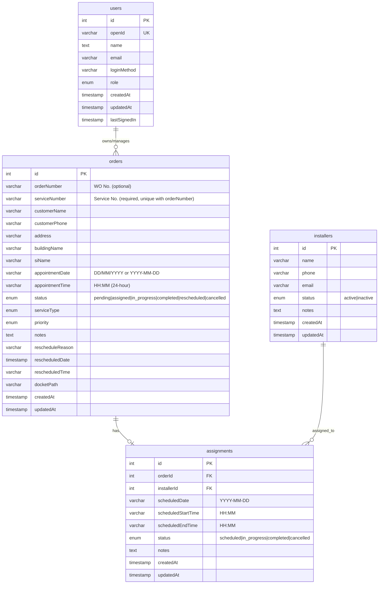
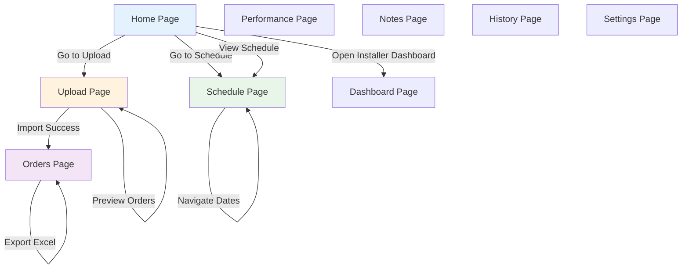
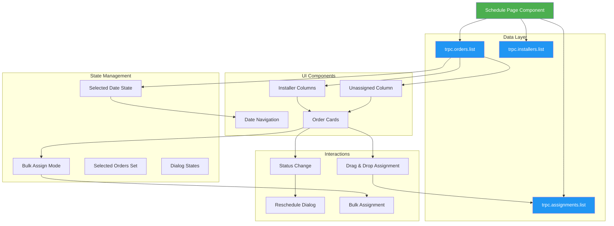
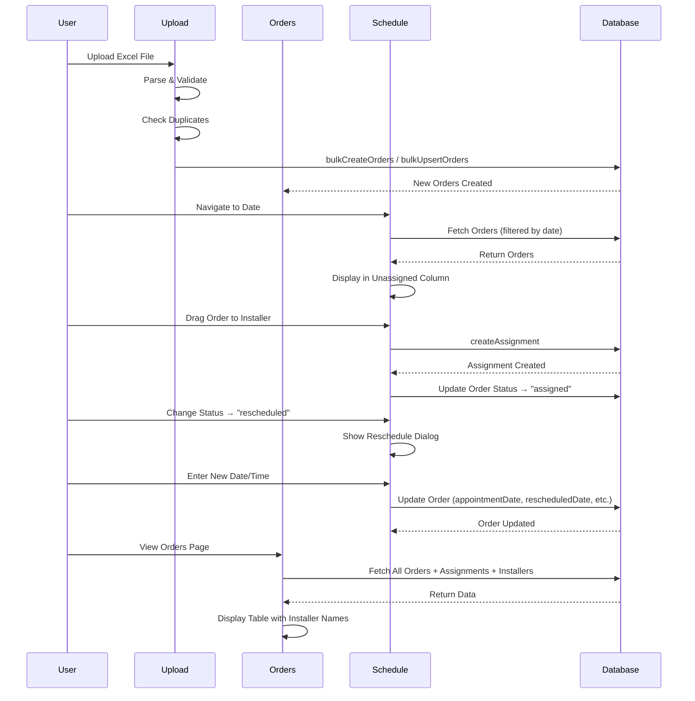
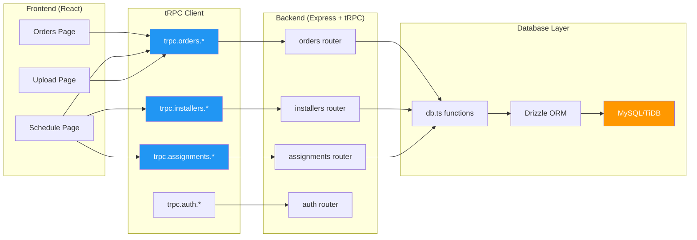
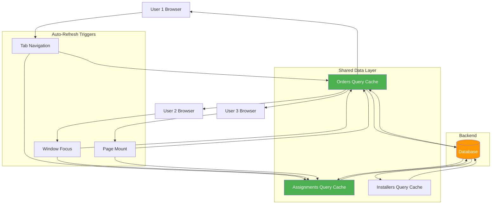
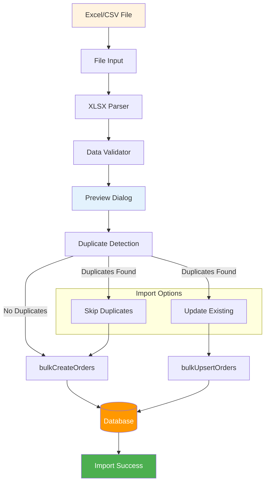
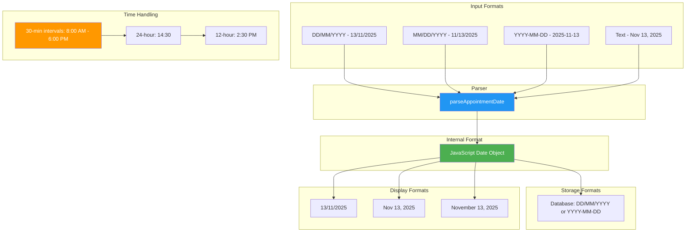
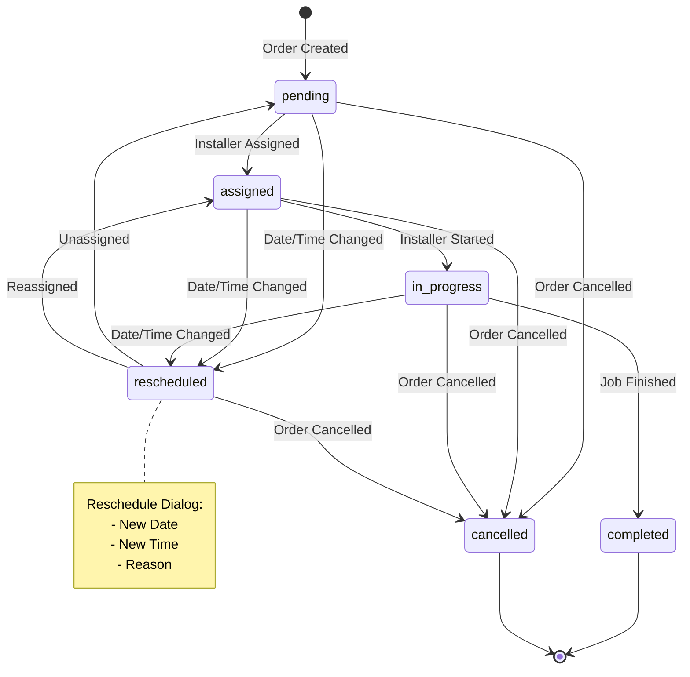

# Service Installer Scheduler - Architecture Documentation

## Overview
This document provides a comprehensive view of the application architecture, data relationships, and component interactions.

---

## 1. Database Schema & Relationships

**Key Relationships:**
- **One Order → Zero or One Assignment** (order can be unassigned)
- **One Installer → Many Assignments** (installer can have multiple jobs)
- **Unique Constraint**: `(serviceNumber, orderNumber)` prevents duplicates

---

## 2. Application Navigation & Page Flow

---

## 3. Schedule Page - Component Architecture

---

## 4. Data Flow - Order Lifecycle

---

## 5. Schedule Card - Detailed View

```mermaid
graph TB
    OrderCard[Order Card Component]
    
    subgraph "Card Header"
        ServiceNo[Service Number - Bold]
        WONo[WO Number - Gray Optional]
        Checkbox[Bulk Select Checkbox]
    end
    
    subgraph "Card Body"
        Customer[Customer Name]
        Time[Appointment Time]
        Building[Building Name]
        Status[Status Badge]
    end
    
    subgraph "Card Actions"
        StatusDropdown[Status Dropdown]
        HistoryBtn[History Button]
        DragHandle[Drag Handle]
    end
    
    subgraph "Card States"
        Unassigned[Gray - Unassigned]
        Assigned[Blue - Assigned]
        InProgress[Yellow - In Progress]
        Completed[Green - Completed]
        Rescheduled[Orange - Rescheduled]
        Cancelled[Red - Cancelled]
    end
    
    OrderCard --> ServiceNo
    OrderCard --> WONo
    OrderCard --> Checkbox
    OrderCard --> Customer
    OrderCard --> Time
    OrderCard --> Building
    OrderCard --> Status
    OrderCard --> StatusDropdown
    OrderCard --> HistoryBtn
    OrderCard --> DragHandle
    
    Status --> Unassigned
    Status --> Assigned
    Status --> InProgress
    Status --> Completed
    Status --> Rescheduled
    Status --> Cancelled
    
    style OrderCard fill:#fff,stroke:#333,stroke-width:2px
    style ServiceNo fill:#2196f3,color:#fff
    style Completed fill:#4caf50,color:#fff
    style Rescheduled fill:#ff9800,color:#fff
    style Cancelled fill:#f44336,color:#fff
```

---

## 6. tRPC API Routes

**Key API Endpoints:**

**orders.**
- `list` - Get all orders
- `create` - Create single order
- `bulkCreate` - Import multiple orders (with duplicate detection)
- `update` - Update order details
- `delete` - Delete order (also deletes assignments)
- `updateStatus` - Change order status

**installers.**
- `list` - Get all installers
- `create` - Add new installer
- `bulkCreate` - Import multiple installers
- `update` - Update installer details
- `delete` - Delete installer

**assignments.**
- `list` - Get all assignments
- `create` - Assign order to installer
- `update` - Update assignment details
- `delete` - Remove assignment
- `deleteByOrder` - Remove all assignments for an order

**auth.**
- `me` - Get current user
- `logout` - Sign out

---

## 7. Multi-User Collaboration Features

**Collaboration Features:**
- **Auto-refresh on tab switch** - Data refreshes when navigating between pages
- **Auto-refresh on window focus** - Data refreshes when returning to browser tab
- **Default today's filter** - Orders page shows only today's appointments by default
- **Real-time updates** - Multiple users see latest data when they interact with the app

---

## 8. File Upload & Processing Flow

**Supported Formats:**
- **Standard Format**: orderNumber, customerName, customerPhone, serviceType, address, priority, notes
- **Work Order Format**: WO No., Service No., Customer Name, Contact No., WO Type, Sales/Modi Type, App Date, App Time, Building Name, SI Name

**Duplicate Detection Logic:**
- Checks `(serviceNumber, orderNumber)` combination
- Same Service No. + Same WO No. = Duplicate
- Same Service No. + Different WO No. = NOT Duplicate (allows multiple work orders per service)

---

## 9. Time & Date Format Handling

**Key Utilities:**
- `parseAppointmentDate()` - Handles all date formats
- `generateTimeSlots()` - Creates 30-minute intervals
- `formatTimeSlot()` - Converts 24h to 12h format
- `normalizeTimeFormat()` - Removes leading zeros

---

## 10. Order Status Lifecycle

**Status Colors:**
- **Pending** - Gray
- **Assigned** - Blue
- **In Progress** - Yellow
- **Completed** - Green
- **Rescheduled** - Orange
- **Cancelled** - Red

---

## Summary

This Service Installer Scheduler application is built with:

**Frontend:**
- React 19 + Tailwind CSS 4
- tRPC for type-safe API calls
- React DnD for drag-and-drop
- Wouter for routing

**Backend:**
- Express 4 + tRPC 11
- Drizzle ORM
- MySQL/TiDB database
- Manus OAuth authentication

**Key Features:**
- Excel/CSV import with duplicate detection
- Drag-and-drop assignment
- Multi-user collaboration with auto-refresh
- 30-minute time intervals
- Reschedule dialog
- Bulk operations
- Real-time status updates
- Mobile-responsive design

**Data Flow:**
1. Orders uploaded via Excel → Stored in database
2. Orders displayed in Schedule → Filtered by date
3. Drag order to installer → Creates assignment
4. Status changes → Triggers dialogs (reschedule, completion)
5. All changes → Auto-refresh for all users
